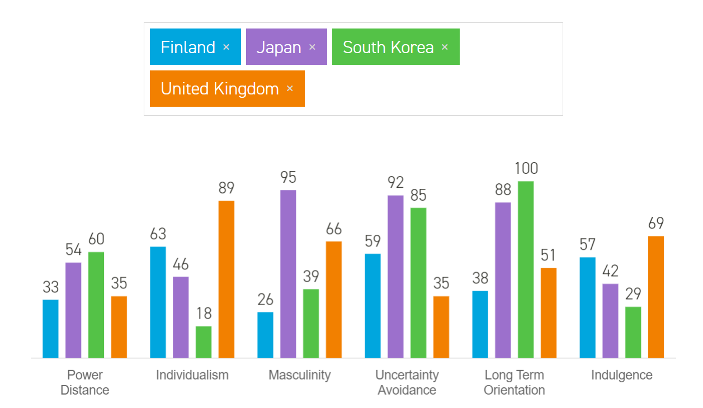

다른 문화를 이해하는 6가지의 지표

[https://www.hofstede-insights.com/country-comparison/](https://www.hofstede-insights.com/country-comparison/)

## Power Distance

- 단체에 속한 사람이 끼칠수 있는 힘이 얼마만큼 차이가 있는가
- 할아버지와 손자, 회사의 사장과 말단 직원
- 숫자가 작으면 공평한 사회, 크면 계층간 차이가 크고 불공평한 사회
- 핀란드 33, 한국 60, 중국 80 

## Individualism
- 개인주의
- 숫자가 작으면 단체를 더 중요하게 여기고, 크면 개인을 우선시 함
- 한국 18, 중국 20, 핀란드 63, 영국 89

## Masculinity
- 남성/여성의 역할이 전형적인가
- 남성은 힘쓰는 일하고, 권력이 있고, 여성은 부드럽고 겸손해야 하고..
- 숫자가 크면 전형적인 성 역할이 고착되어 있는 사회
- 핀란드 26, 한국 39, 일본 95

## Uncertainty Avoidance
- 불확실성을 피하려는 정도
- 숫자가 작으면 여유가 있고, 창의적인 아이디어를 중요시 하는 사회
- 숫자가 크면 경직되어 있고, 항상 바쁘고 새로운 아이디어를 받아들일 여유가 없는 사회
- 아일랜드 35, 핀란드 59, 한국 85

## Long term Orientation
- 미래의 성공에 초점을 두는가 현재를 중요시 여기는가
- 숫자가 작으면 과거의 관습을 중요시 여기고, 일 처리를 항상 하던 방식으로 함. 오늘을 중요시
- 숫자가 크면 미래에 초점을 두고 인내와 노력을 중요시. 내일을 위해 오늘은 저축
- 아일랜드 24, 핀란드 38, 한국 100

## Indulgence
- 충동과 욕망의 실현 vs 억제
- 숫자가 작으면 충동과 욕구를 억제하고, 인생을 즐기지 못하는 경향의 사회
- 숫자가 크면 충동과 욕구를 실현하고 인생을 즐기는 사회
- 한국 29, 독일 40, 영국 69

